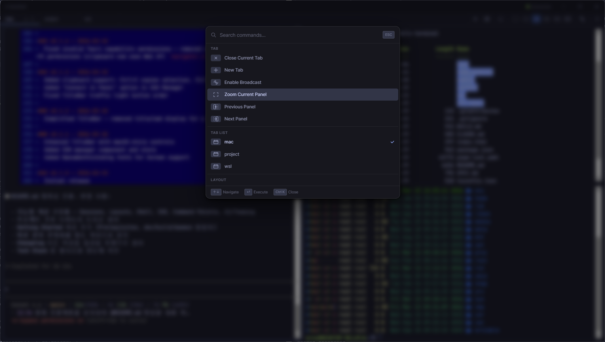
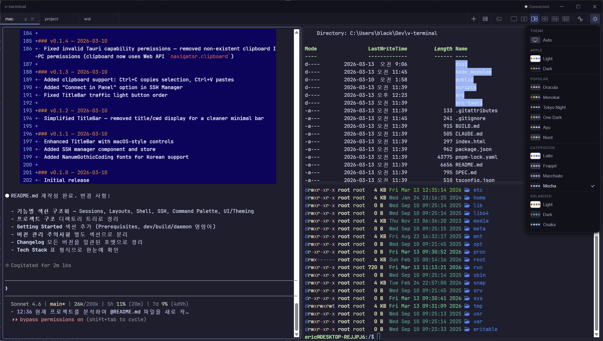

# v-terminal

A fast, native terminal emulator built with Tauri + React + xterm.js. Designed for Windows with persistent sessions, multi-panel layouts, and a polished Apple HIG-compliant UI.

## Tech Stack

| Layer | Technology |
|---|---|
| Frontend | React 18, TypeScript, Vite 5 |
| Terminal | xterm.js 5 (FitAddon, WebLinksAddon, Unicode11) |
| State | Zustand 4 |
| Backend | Tauri 2, Rust |
| PTY | portable-pty (in-process, direct IPC) |
| Fonts | Pretendard (UI), JetBrains Mono Nerd Font (terminal) |

## Features

### Sessions & Daemon
- **Persistent sessions** via an out-of-process daemon (`v-terminal-daemon`) — closing a tab detaches instead of killing the shell
- **4MB scrollback buffer** per session, streamed on re-attach
- **Session restoration** — tabs auto-saved to localStorage on app close and restored on next launch
- **Session picker** — choose to start fresh or re-attach to a running daemon session
- **Auto-reconnect** — exponential backoff reconnection with live status indicator in the title bar

### Layouts & Tabs
- **Multi-panel grids** — 1, 2, 3, 4, 6, 9 panels per tab
- **Panel zoom** — toggle any panel to full-screen within the tab
- **Broadcast mode** — send keystrokes to all panels simultaneously
- **Tab context menu** — send to background vs. kill process
- **Tab activity badges** — unread output indicator with pulse animation

### Shell Support
- **Windows**: auto-detects PowerShell 7 → Windows PowerShell 5.1 → cmd.exe via PATH search
- **WSL**: drop-down distro selector (cached on startup for instant response)
- **Custom shells**: configure arbitrary shell program and arguments

### SSH
- **SSH profile manager** — save, edit, and delete connection profiles
- **Connect modes**: new tab, current panel, or all panels at once
- **Custom port and identity file** support

### Command Palette (`Ctrl+K`)



- Tab operations (new, close, rename, broadcast toggle)
- Panel navigation (next, prev, zoom)
- Layout switching
- Quick tab switching
- SSH quick-connect

### UI & Theming



- **System-adaptive light/dark theme** — follows OS preference automatically
- **Popular themes** — Dracula, Gruvbox, Nord, Solarized, and more
- **Frosted glass** title bar and tab bar (backdrop-filter)
- **macOS-style traffic lights** — close, minimize, zoom with HIG-correct order and hover icons
- **URL click support** — clickable links in terminal output

## Getting Started

### Prerequisites

- Rust + Cargo (`rustup`)
- Microsoft C++ Build Tools
- Node.js + pnpm
- WebView2 Runtime (built-in on Windows 11)

### Development

```bash
pnpm install
pnpm tauri dev       # Hot-reload dev mode
```

### Production Build

```bash
pnpm tauri build     # Output: src-tauri/target/release/bundle/
```

### Daemon (manual)

```bash
pnpm daemon:start    # Start daemon for debugging
pnpm daemon:stop     # Stop daemon
```

## Changelog

### v0.5.0 - 2026-03-18

- **refactor**: Removed out-of-process daemon — PTY sessions now run directly in the Tauri backend via `PtyManager`
- **refactor**: Removed daemon binary, client, state management, build scripts, and splash screen
- **feat**: Direct PTY IPC commands (`pty_commands`, `wsl_commands`) for lower-latency terminal I/O
- **feat**: Restored SessionPicker as the new tab page with layout and connection picker
- **fix**: `pty_create` changed to async for proper tokio runtime context
- **fix**: Window-state plugin VISIBLE flag excluded from restore; close changed to `CloseRequested`
- **style**: New tab page content centered with cleaner layout

### v0.4.0 - 2026-03-17

- **feat**: Clipboard history with command palette integration (`!` prefix) and localStorage persistence
- **feat**: Cheatsheet panel — Vim, Git, Docker, kubectl quick references with copy-to-clipboard
- **feat**: Cheatsheet drill-down navigation in command palette (`?` prefix)
- **feat**: Lightweight toast notification component
- **perf**: Daemon protocol switched to base64 encoding for binary data transfer
- **perf**: TCP write backpressure with bounded channel per connection
- **perf**: Scrollback optimized with bulk drain
- **feat**: Graceful daemon shutdown with signal handling
- **feat**: Session limit (64) and increased broadcast capacity to 4096
- **fix**: KillSession now terminates full child process tree
- **fix**: Broadcast lag recovery with scrollback resync instead of silent drop
- **fix**: Idle freeze prevention (heartbeat + WebGL recovery + listener leak fix)
- **style**: Command palette HIG compliance (44px touch targets, smoother animations)
- **refactor**: Command palette prefixes reassigned (`!` clipboard, `?` cheatsheet, `%` layout)

### v0.3.0 - 2026-03-17

- **feat**: Splash screen with startup progress indicator and 15s daemon timeout
- **feat**: Panel context menu with Switch Connection and full connection list
- **feat**: Command palette `#` prefix for dynamic connection switching per panel
- **feat**: Command palette `!` prefix for layout mode switching
- **feat**: Background tray indicator in tab bar for backgrounded tabs
- **feat**: Tab right-click context menu with background, close, rename actions
- **feat**: 6 new terminal fonts (Commit Mono, Geist Mono, Iosevka, Maple Mono, Victor Mono)
- **perf**: WebGL renderer with Canvas/DOM fallback for improved rendering performance
- **refactor**: Tab close default changed to kill; browser/webview feature fully removed
- **fix**: Apple HIG compliance fixes (6 items), panel context menu emoji replaced with SVG icons
- **fix**: Terminal font hot-reload, font load failure warning in settings
- **fix**: Session restore preserves note/todo data; note panel placeholder switched to English

### v0.2.0 - 2026-03-16

- Minor version bump — consolidates all v0.1.x features into a stable baseline

### v0.1.18 - 2026-03-16

- **feat**: Settings modal with Appearance and Terminal configuration tabs
- **feat**: Bundled terminal font selector (Cascadia Code, Fira Code, Hack, IBM Plex Mono, Inconsolata, Monaspace Neon, Sarasa Mono K, Source Code Pro, Tab0 Mono K)
- **feat**: Terminal font size adjustment support
- **feat**: Alarm system — Pomodoro timer, countdown timer, and recurring alarms with notifications
- **feat**: Toolkit side panel — Notes and Timers merged into unified tabbed panel
- **feat**: Markdown note editor with CodeMirror 6 and per-tab todo lists
- **feat**: Session picker — per-panel layout selection and connection settings
- **feat**: Command palette `@` prefix for direct SSH profile connection
- **feat**: Pomodoro redesign with 4x3 preset grid and stepper controls
- **refactor**: xterm.js upgraded to 6.0.0 with scroll/IME workaround cleanup
- **refactor**: Sidebar consolidated into single Toolkit panel (Ctrl+Shift+N)
- **refactor**: SSH manager refactored to profile-only management with integrated connection workflow
- **refactor**: Command palette UX overhaul with prefix hints and keyboard navigation fixes
- **fix**: Font fallback changed to JetBrainsMonoNerdFont
- **fix**: IME composition output buffering to prevent character drops
- **fix**: IME stuck-state recovery and composition timeout safety net
- **fix**: Alternate buffer scroll restoration skipped correctly during resize and font changes
- **fix**: Terminal scroll jump to top issue resolved
- **fix**: Focus loss causing IME composing flag to stick, blocking Korean input

### v0.1.17 - 2026-03-14

- **feat**: Global note panel with command palette toggle
- **feat**: 4-column layout added
- **feat**: Tab bar overflow — proportional shrink and scroll arrows
- **feat**: Command palette — restore background tabs and tab navigation
- **feat**: SSH Connection modal UX and design improvements
- **feat**: Session picker card grid and empty state improvements
- **refactor**: Appearance theme picker switched to drill-down view
- **refactor**: Tab bar + button inline and toolbar ⋯ overflow menu consolidation
- **refactor**: Close tab button unified to single button; Ctrl+click sends to background
- **refactor**: Design token consistency improvements across all components
- **fix**: Korean IME key leak to PTY during composition
- **fix**: Session picker auto-closes background tab when restoring
- **fix**: Terminal scroll reset after resize
- **fix**: More menu UX and layout improvements

### v0.1.16 - 2026-03-13

- **fix**: Terminal I/O triple-duplication bug resolved
- **refactor**: Tab bar right-side button alignment and design consistency
- **refactor**: Daemon status indicator simplified to a dot next to the title bar
- **refactor**: Tab bar icon design and spacing unified
- **refactor**: Clean code refactoring and performance improvements

### v0.1.15 - 2026-03-13

- **fix**: Toolbar icon alignment — removed gap/separator double-spacing in SplitToolbar
- **fix**: Terminal URL click now opens in the system browser via Tauri shell plugin
- **feat**: Command palette open button added to the toolbar
- **fix**: Panel zoom replaces fullscreen toggle
- **refactor**: UI text fully switched to English; tab list categories separated in command palette
- **fix**: Command palette previous/next tab removed; fullscreen permission added
- **fix**: Command palette fullscreen toggle and focus restoration
- **feat**: Expanded command palette with layout, SSH, tab, and panel commands
- **fix**: Korean IME input reliability improvements in terminal
- **fix**: Preserve terminal scroll position on window resize/maximize

## Version Management

When bumping the version, **both files must be updated together**:

1. `package.json` — `version` field
2. `src-tauri/tauri.conf.json` — `version` field

Tauri reads the installer version exclusively from `tauri.conf.json`. Missing this update causes the installer to report the previous version.

